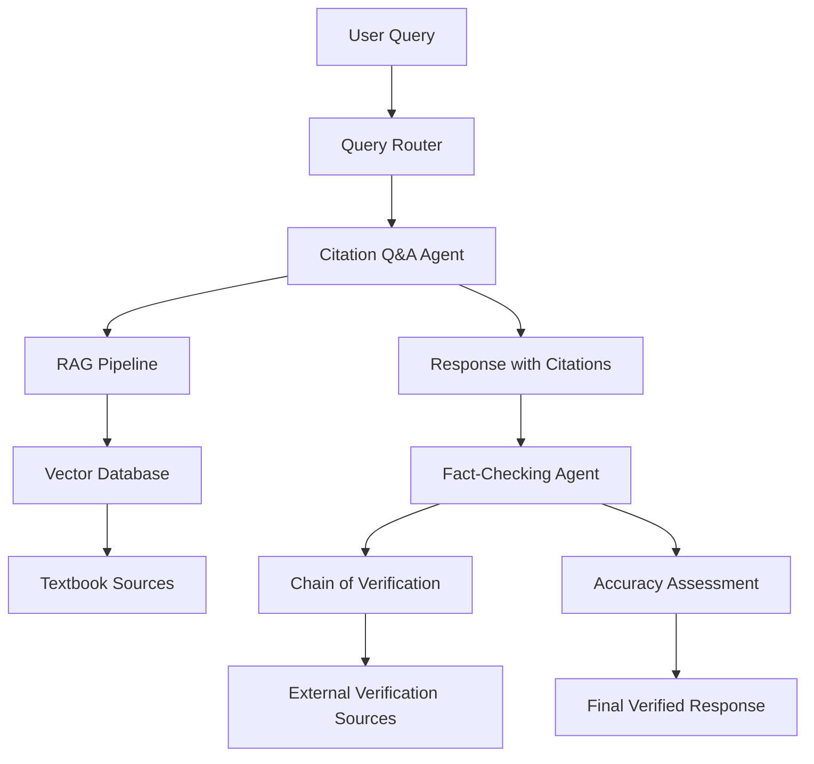

# LangChain Dual-Model Architecture Report
## Citation-Based Q&A and Fact-Checking System for Textbooks

### Executive Summary

This report outlines the architecture for a LangChain-based system involving two specialized models:
1. **Citation Q&A Model**: Answers questions based on textbook content and provides source citations
2. **Fact-Checking Model**: Verifies claims and citations for accuracy

The system leverages cutting-edge 2025 LangChain technologies including LangGraph multi-agent workflows, Chain of Verification (CoVe), and advanced RAG pipelines with built-in citation capabilities.

---

## System Architecture Overview

### Core Components



### Model 1: Citation-Based Q&A System

**Purpose**: Answer questions based on textbook information while providing accurate source citations.

**Architecture Components**:
- **RAG Pipeline**: Retrieval-Augmented Generation with LangChain
- **Vector Database**: Stores processed textbook content with paragraph-level indexing
- **Citation Engine**: Structured output parsing for source attribution
- **Document Processor**: Handles textbook ingestion and chunking

**Key Features**:
- In-text citing with paragraph-level granularity
- Structured output schema using Pydantic for consistent citation format
- Support for multiple textbook formats (PDF, HTML, plain text)
- Tool-calling integration for precise source reference

### Model 2: Fact-Checking and Verification System

**Purpose**: Verify claims and citations produced by the Q&A model for accuracy and reliability.

**Architecture Components**:
- **Chain of Verification (CoVe)**: 4-step verification process
- **Multi-Agent Verification**: Specialized agents for different verification tasks
- **External Source Integration**: Web search and academic database access
- **Hallucination Detection**: Advanced accuracy checking mechanisms

**Key Features**:
- Independent verification using "Factored method"
- External search integration (Serper API, academic databases)
- Structured verification reporting
- Citation accuracy validation

---

## Technical Implementation Details

### 1. Citation Q&A Model Implementation

#### Document Processing Pipeline
```python
# Pseudo-code structure
class TextbookProcessor:
    def __init__(self):
        self.text_splitter = RecursiveCharacterTextSplitter(
            chunk_size=1000,
            chunk_overlap=200
        )
        self.embeddings = OpenAIEmbeddings()
        self.vectorstore = FAISS.from_documents()
    
    def process_textbook(self, textbook_path):
        # Load and chunk textbook content
        # Add paragraph-level IDs for citation
        # Store in vector database with metadata
```

#### Citation-Enabled RAG Chain
```python
# Structured output for citations
class CitedResponse(BaseModel):
    answer: str
    citations: List[Citation]
    
class Citation(BaseModel):
    source_id: str
    page_number: int
    paragraph_id: str
    quote: str
```

#### Vector Database Schema
- **Content**: Textbook paragraph text
- **Metadata**: 
  - `book_title`: Source textbook title
  - `page_number`: Page reference
  - `paragraph_id`: Unique paragraph identifier
  - `chapter`: Chapter information
  - `section`: Section headers

### 2. Fact-Checking Model Implementation

#### Chain of Verification (CoVe) Workflow
1. **Baseline Response Analysis**: Parse claims from Q&A response
2. **Verification Question Generation**: Create specific verification queries
3. **Execute Verification**: Independent fact-checking using external sources
4. **Final Assessment**: Synthesize verification results

#### Multi-Agent Verification System
```python
# LangGraph multi-agent architecture
class FactCheckingAgents:
    - ClaimExtractor: Identifies factual claims
    - CitationValidator: Verifies source accuracy
    - ExternalSearcher: Queries external databases
    - AccuracyGrader: Assesses overall reliability
```

---

## Workflow Options

### Option 1: Sequential Pipeline
**Flow**: User Query → Q&A Model → Fact-Checker → Response
- **Pros**: Simple implementation, clear verification trail
- **Cons**: Higher latency, sequential processing

### Option 2: Parallel Verification
**Flow**: User Query → Q&A Model + Parallel Fact-Checking → Synthesis
- **Pros**: Faster response time, real-time verification
- **Cons**: More complex orchestration, higher resource usage

### Option 3: Agentic RAG with Integrated Verification
**Flow**: User Query → Multi-Agent System (Q&A + Verification) → Response
- **Pros**: Most sophisticated, best accuracy, adaptive workflow
- **Cons**: Complex implementation, requires careful agent coordination

---

## Technology Stack Recommendations

### Core Framework
- **LangChain 0.1+**: Main framework for LLM orchestration
- **LangGraph**: Multi-agent workflow management
- **LangSmith**: Observability and evaluation

### Vector Databases
**Primary Options**:
- **FAISS**: Local deployment, good for prototyping
- **Pinecone**: Cloud-hosted, production-ready
- **ChromaDB**: Open-source, easy setup
- **Weaviate**: Advanced metadata filtering

### Language Models
**Q&A Model Options**:
- **GPT-4 Turbo**: Excellent reasoning and citation capabilities
- **Claude 3.5 Sonnet**: Strong academic text understanding
- **Llama 3.1 70B**: Open-source alternative

**Fact-Checking Model Options**:
- **GPT-4o**: Superior verification reasoning
- **Claude 3 Opus**: Excellent fact-checking capabilities
- **Specialized fine-tuned models**: Custom verification models

### External Verification Sources
- **Serper API**: Web search integration
- **Semantic Scholar API**: Academic paper verification
- **CrossRef API**: Citation validation
- **Wikipedia API**: General knowledge verification

---

## Implementation Roadmap

### Phase 1: Foundation Setup (Weeks 1-2)
- [ ] Set up LangChain development environment
- [ ] Implement basic RAG pipeline with FAISS
- [ ] Create textbook document processor
- [ ] Develop citation output schema

### Phase 2: Citation Q&A Model (Weeks 3-4)
- [ ] Implement structured citation system
- [ ] Add paragraph-level indexing
- [ ] Create citation-aware prompts
- [ ] Test with sample textbooks

### Phase 3: Fact-Checking Integration (Weeks 5-6)
- [ ] Implement Chain of Verification
- [ ] Add external search capabilities
- [ ] Create verification agents
- [ ] Develop accuracy scoring system

### Phase 4: Multi-Agent Integration (Weeks 7-8)
- [ ] Implement LangGraph orchestration
- [ ] Add agent communication protocols
- [ ] Create workflow management
- [ ] Implement error handling

### Phase 5: Testing and Optimization (Weeks 9-10)
- [ ] Comprehensive system testing
- [ ] Performance optimization
- [ ] Citation accuracy evaluation
- [ ] User interface development

---

## Expected Challenges and Solutions

### Challenge 1: Citation Accuracy
**Problem**: Ensuring citations precisely match source content
**Solution**: Implement exact text matching with fuzzy search fallback

### Challenge 2: Verification Latency
**Problem**: Fact-checking adds significant response time
**Solution**: Implement caching and parallel processing

### Challenge 3: Agent Coordination
**Problem**: Complex multi-agent workflows can fail
**Solution**: Robust error handling and fallback mechanisms

### Challenge 4: Context Management
**Problem**: Maintaining context across agent interactions
**Solution**: Centralized state management with LangGraph

---

## Performance Metrics and Evaluation

### Citation Quality Metrics
- **Citation Accuracy**: Percentage of correctly attributed sources
- **Quote Precision**: Exact match rate for cited text
- **Source Coverage**: Breadth of textbook sources utilized

### Fact-Checking Metrics
- **Verification Accuracy**: Percentage of correctly identified false claims
- **False Positive Rate**: Incorrectly flagged accurate information
- **Response Time**: Average time for complete verification

### System Performance Metrics
- **End-to-End Latency**: Total response time
- **Agent Success Rate**: Percentage of successful agent executions
- **Resource Utilization**: Compute and memory usage

---

## Cost Estimation

### Development Costs
- **Development Time**: 10 weeks (2 developers)
- **LLM API Costs**: $500-1000/month during development
- **Vector Database**: $50-200/month depending on scale

### Production Costs (Monthly)
- **LLM API Costs**: $2000-5000 (depending on usage)
- **Vector Database**: $200-1000 (depending on scale)
- **External APIs**: $100-300 (search and verification)
- **Infrastructure**: $300-800 (compute resources)

---

## Conclusion and Recommendations

The proposed dual-model architecture leverages state-of-the-art LangChain capabilities to create a robust, citation-aware Q&A system with integrated fact-checking. The system is designed to handle academic textbook content with high accuracy and reliability.

### Recommended Implementation Approach
1. **Start with Option 1** (Sequential Pipeline) for initial development
2. **Upgrade to Option 3** (Agentic RAG) for production deployment
3. **Use GPT-4 family models** for both Q&A and fact-checking
4. **Implement comprehensive evaluation framework** from the beginning

### Key Success Factors
- Careful prompt engineering for citation accuracy
- Robust error handling and fallback mechanisms
- Comprehensive testing with diverse textbook content
- Iterative improvement based on user feedback

This architecture provides a solid foundation for building an advanced, reliable textbook Q&A system with built-in verification capabilities, positioning it well for academic and educational applications.